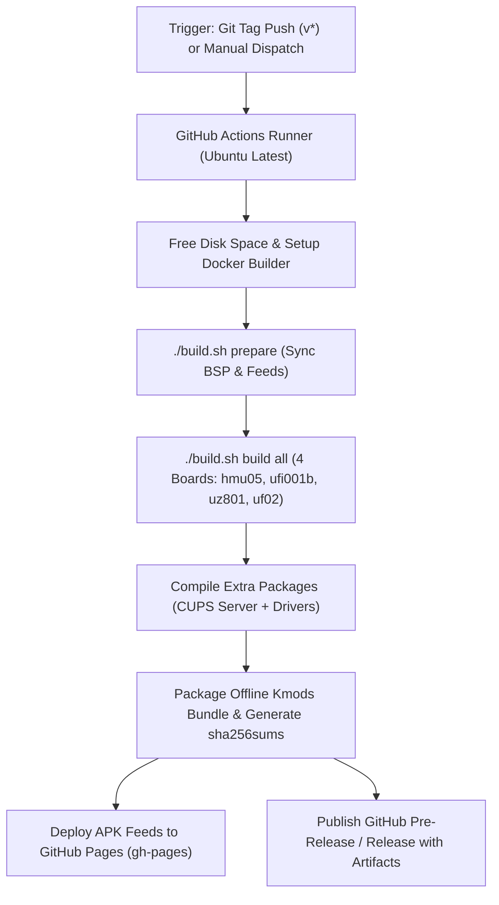

# GitHub Actions CI/CD Workflow Guide

This document explains the architecture, execution flow, automated packaging, and release deployment of the GitHub Actions CI/CD pipeline for **OpenWrt on Qualcomm MSM8916** devices.

---

## 1. Overview & Architecture

The GitHub Actions workflow is defined in [`.github/workflows/build-and-release.yml`](../.github/workflows/build-and-release.yml). It provides a fully automated cloud build pipeline that:
1. **Spins up an Ubuntu runner** with Docker and build dependencies.
2. **Builds the Docker build container** and prepares the OpenWrt source tree.
3. **Compiles all 4 target device firmwares** (`hmu05`, `ufi001b`, `uz801`, `uf02`).
4. **Compiles modular kernel drivers (kmods)** and extra packages (like the **CUPS Print Server**).
5. **Packages an offline Kmod bundle** (`kmods-msm8916-<version>.tar.gz`) and generates cryptographic `sha256sums`.
6. **Deploys OpenWrt package feeds** (`packages.adb` APK repositories) to **GitHub Pages** (`gh-pages` branch).
7. **Publishes a GitHub Release** containing all flashable images, sysupgrade archives, recovery firmware packages, and checksums.



---

## 2. Triggering the Workflow

### Method A: Automated Tag Push (Recommended)
Pushing any git tag starting with `v` automatically triggers the build and release pipeline:
```bash
# Create and push a pre-release candidate tag:
git tag -a v25.12.5-rc1 -m "Release Candidate 1 for OpenWrt 25.12.5"
git push origin v25.12.5-rc1
```

### Method B: Manual Workflow Dispatch
You can manually run the workflow from GitHub's web interface without creating a new git tag:
1. Go to your repository on GitHub: **`Actions`** tab.
2. Select **`Build OpenWrt MSM8916 & Release`** in the left sidebar.
3. Click **`Run workflow`**.
4. (Optional) Provide a custom `release_tag` (e.g. `v25.12.5-r1`) or leave blank to use the default version.

---

## 3. Detailed Step-by-Step Pipeline

| Step | Action | Description |
| :--- | :--- | :--- |
| **1. Checkout Repository** | `actions/checkout@v4` | Clones the repository with full git history and submodules. |
| **2. Free Disk Space** | Shell script | Removes pre-installed .NET, MySQL, PHP, and Android SDKs from the GitHub runner, freeing **~35 GB** of disk space for OpenWrt compilation. |
| **3. Determine Version & Tag** | Shell script | Reads `version` file and parses the git tag to set release tags and archive filenames. |
| **4. Prepare Build Tree** | `./build.sh prepare` | Builds the isolated `openwrt-builder` Docker container, updates OpenWrt package feeds (`packages`, `luci`, `routing`, `telephony`, `video`), installs patches, and symlinks project packages into `openwrt/package/msm8916/`. |
| **5. Compile All Firmwares** | `./build.sh build all` | Runs OpenWrt compilation in parallel across all 4 device configurations: `hmu05`, `ufi001b`, `uz801`, and `uf02`. Compiles the kernel (`boot.img`), squashfs rootfs (`system.img`), and sysupgrade archives (`sysupgrade.bin`). |
| **6. Compile Extra Packages** | Docker `make` | Explicitly compiles extra standalone packages (e.g. CUPS print server daemon, client, drivers) and generates the package index (`package/index`). |
| **7. Package Offline Kmods** | Shell script | Bundles all compiled `.apk` kernel modules and drivers into a portable `kmods-msm8916-<version>.tar.gz` archive and computes SHA-256 hashes in `sha256sums`. |
| **8. Deploy to GitHub Pages** | `peaceiris/actions-gh-pages@v4` | Copies the APK repositories to the `gh-pages` branch, publishing live package feeds accessible over HTTP. |
| **9. Publish GitHub Release** | `softprops/action-gh-release@v2` | Creates the GitHub Release, attaches [`FLASHING_AND_RELEASE_GUIDE.md`](./FLASHING_AND_RELEASE_GUIDE.md) as the release notes, and uploads all binary artifacts. |

---

## 4. Release Artifacts Generated

Each successful workflow run uploads the following artifacts directly to the GitHub Release:

1. **Boot Images (`boot.img`)**: Android boot format containing Linux kernel and device tree blobs (DTBs).
   - `openwrt-msm89xx-msm8916-generic-hmu05-squashfs-boot.img`
   - `openwrt-msm89xx-msm8916-generic-ufi001b-squashfs-boot.img`
   - `openwrt-msm89xx-msm8916-yiming-uz801v3-squashfs-boot.img`
   - `openwrt-msm89xx-msm8916-generic-uf02-squashfs-boot.img`
2. **Root Filesystem Images (`system.img`)**: Read-only SquashFS partition for the rootfs.
   - `openwrt-msm89xx-msm8916-*-squashfs-system.img`
3. **Web / CLI Sysupgrade Archives (`sysupgrade.bin`)**: Standard OpenWrt upgrade archives for flashing from LuCI Web GUI or command line.
   - `openwrt-msm89xx-msm8916-*-squashfs-sysupgrade.bin`
4. **Complete Firmware Recovery Bundles (`firmware.zip`)**: Bundled GPT partition tables and flash scripts for full device unbricking via EDL mode.
5. **Offline Kernel Module Bundle (`kmods-msm8916-<version>.tar.gz`)**: All compiled kernel modules (Bluetooth, USB printer, CAKE scheduler, cellular drivers) for offline installation.
6. **Integrity Checksums (`sha256sums`)**: Cryptographic SHA-256 hashes of all release artifacts.

---

## 5. Live Package Repository (GitHub Pages)

The workflow deploys all compiled `.apk` packages to **GitHub Pages**, providing an automated remote package feed:

- **Target Kmods & Drivers**:
  ```text
  https://akbar-npj.github.io/msm8916-openwrt/releases/<version>/targets/msm89xx/msm8916/packages/
  ```
- **Base Architecture Packages**:
  ```text
  https://akbar-npj.github.io/msm8916-openwrt/releases/<version>/packages/aarch64_generic/base/
  ```

### Adding Feeds to Device:
On the running device, custom repositories can be configured in `/etc/apk/repositories.d/customfeeds.list`:
```text
https://akbar-npj.github.io/msm8916-openwrt/releases/25.12.5/targets/msm89xx/msm8916/packages
https://akbar-npj.github.io/msm8916-openwrt/releases/25.12.5/packages/aarch64_generic/base
```
Then packages can be installed on-demand:
```bash
apk update
apk add cups-daemon cups-client kmod-sched-cake kmod-usb-printer kmod-bluetooth
```

---

## 6. Troubleshooting & Best Practices

1. **Feed Index Warnings (`Ignoring feed 'packages' - index missing`)**:
   - Ensure `scripts/openwrt-prepare.sh` checks both directory existence AND `feeds/<feed>.index` existence before skipping feed updates.
2. **Build Order and Dependencies in In-Tree Packages**:
   - Packages in `packages/` that rely on target libraries (e.g. `libudev-zero`, `qrtr`, `zlib`) must declare `PKG_BUILD_DEPENDS` in their `Makefile` and include `TARGET_CFLAGS += -I$(STAGING_DIR)/usr/include` and `TARGET_LDFLAGS += -L$(STAGING_DIR)/usr/lib` in `MAKE_FLAGS`.
3. **Runner Out-of-Disk Errors**:
   - The workflow includes an explicit disk space cleanup step (`rm -rf /usr/share/dotnet ...`) to ensure the 4-target compilation does not exceed runner disk quotas.
