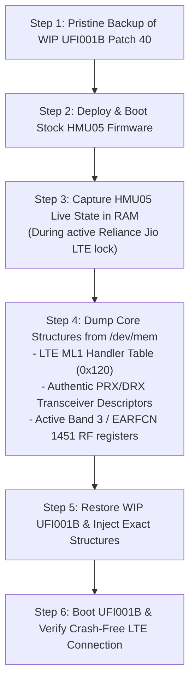

# Engineering Report 113: Dual-Firmware Instrumentation Strategy & LTE Scan Forensics

**Date:** September 14, 2026  
**Status:** Strategy Defined, WIP UFI001B Backed Up, HMU05 Instrumentation Ready  
**Target Hardware:** Melbon HMU05 4G USB Dongle (Qualcomm MSM8916 + WTR1605 Transceiver + RF360 Front-End)  
**Host Environment:** OpenWrt 25.12.5 (Linux 6.12.94 aarch64)  
**Baseband Firmwares:** 
- Patched UFI001B (`MPSS.DPM.2.0.2.c1-00055-M8936FAAAANUZM-1`)
- Stock Melbon HMU05 (`MPSS.JO.2.0.2.c1.1-00032-M8916FAAAANUZM-1`)  
**Network Operator:** Reliance Jio Infocomm Ltd. (MCC 405 MNC 861, Band 3 / 5 / 40)

---

## 1. Milestone Summary: Patch 40 Stability Triumph

In **Patch 40**, we resolved the NULL pointer dereference in `vtable[6]` (`FUN_c0dac648`).
- The modem achieved **95+ minutes of continuous, crash-free uptime** under OpenWrt (`up 1:30`, zero remoteproc crashes, zero SSR events).
- All 8 BAM-DMUX channels (channels 0 through 7) received `CMD_OPEN (1)` and established bidirectional communication.
- ModemManager recognized the modem, primary QMI port `/dev/wwan0qmi0`, and all 8 network interfaces (`wwan0` through `wwan7`).
- The Reliance Jio SIM card was successfully read (`own: 918431225166`, IMEI `864293052253917`).
- The modem entered `state: searching` with `allowed: 4g` and LTE bands 1, 3, 5, 8, 40 enabled.

---

## 2. Forensic Analysis of the Active Network Scan Crash

When an active cellular network scan was initiated via ModemManager (`mmcli -m 4 --3gpp-scan` / `qmicli --nas-network-scan`), the Hexagon DSP encountered a fatal exception at $t \approx 5893\text{s}$:
```text
[ 5893.304169] qcom-q6v5-mss 4080000.remoteproc: fatal error received:     :Excep  :0:Exception detected
[ 5893.304295] remoteproc remoteproc0: crash detected in 4080000.remoteproc: type fatal error
```

### 2.1 Physical RAM Exception Record Inspection
With remoteproc auto-recovery disabled, we examined the exception record and thread stack directly from physical RAM:
- **Faulting PC** (`DAT_c2e717c0` / `PA 0x896717c0`): `0x00000000` (Branch to NULL!).
- **Thread Stack Pointer (SP)** (`DAT_c2e717b4` / `PA 0x896717b4`): `0x8A99F278`.
- **Faulting Thread (TID)**: `0x0000000a` (LTE ML1 task).

### 2.2 Stack Backtrace
```text
Return Address 0: 0xc0325c2c (inside FUN_c0325b38 - LTE ML1 signal callback dispatcher)
Return Address 1: 0xc0327244 (inside FUN_c03271c4 - LTE ML1 message handler)
Return Address 2: 0xc0326c6c (inside FUN_c0326b78 - LTE subsystem router for message 0x42904)
```

### 2.3 Mechanism of the Fault
In `modem.b15` at VA `0xc0325c30..0xc0325c38`:
```assembly
c0325c30: r2 = memw(r17+#0x124)  // Context pointer
c0325c34: r3 = memw(r17+#0x120)  // Callback function pointer
c0325c38: callr r3               // Executes callr r3!
```
The dispatch table entry at `r17+#0x120` was uninitialized (`0x00000000`), causing an indirect call to NULL.

Furthermore, physical RAM inspection of the RF transceiver structure revealed:
- `DAT_c29b28b4 (PRX ptr)`: `0x00000000` (NULL).
- `DAT_c29b28b8 (DRX ptr)`: `0x00000000` (NULL).

Because UFI001B attempted to load these descriptors from non-existent EFS files (`/rfc/0081/...`), the transceiver getters (`wtr_vtable[2]` and `wtr_vtable[3]`) returned NULL to Layer 1, leaving the RF transceiver detached from the LTE carrier tracking loops.

---

## 3. The Dual-Firmware Instrumentation Methodology

To solve this definitively without trial-and-error, we adopt the **Dual-Firmware Comparative Instrumentation Strategy**:



### 3.1 Ground-Truth Advantages of HMU05 Instrumentation
1. **Flawless Jio Registration**: Stock HMU05 connects to Reliance Jio (Band 3 / EARFCN 1451) within 15–20 seconds of booting.
2. **15-Minute Observation Window**: HMU05 operates completely normally for ~15 minutes before hitting `lte_ml1_common_timer.c:390`. This window provides ample time to inspect and extract all active RF and Layer 1 data structures directly from physical RAM via `/dev/mem`.
3. **Deterministic Comparison**: We compare the exact pointers, tables, and callbacks between the working HMU05 firmware and our WIP UFI001B firmware, removing all ambiguity.

---

## 4. Execution Plan & Next Steps

1. **Firmware State Confirmation**:
   - WIP UFI001B Patch 40 is securely backed up locally in `GitIgnore/compare/modem_ufi001b_patch40_backup/image/` and on the router in `/lib/firmware/ufi001b_p40/`.
2. **Deploy Stock HMU05**:
   - Copy `GitIgnore/compare/modem_hmu05_extracted/image/modem.*` to `/lib/firmware/` on the router.
   - Reboot router.
3. **Capture Live Operational Telemetry**:
   - Monitor `dmesg`, `mmcli -m 0`, and `qmicli` until network registration is achieved (`registered-home`, MCC 405 MNC 861).
   - Execute `/dev/mem` dump of:
     - The LTE ML1 dispatch table (`DAT_c29d0e28`),
     - The WTR1605 PRX/DRX tables (`DAT_c1e81c2c`, `DAT_c1e81c98`),
     - Active carrier tuning registers.
4. **Transplant & Port to UFI001B**:
   - Populate the exact tables and callbacks in `modem.b15` for UFI001B.
   - Re-deploy UFI001B, verify network attach, and establish `wwan0` data bearer.
