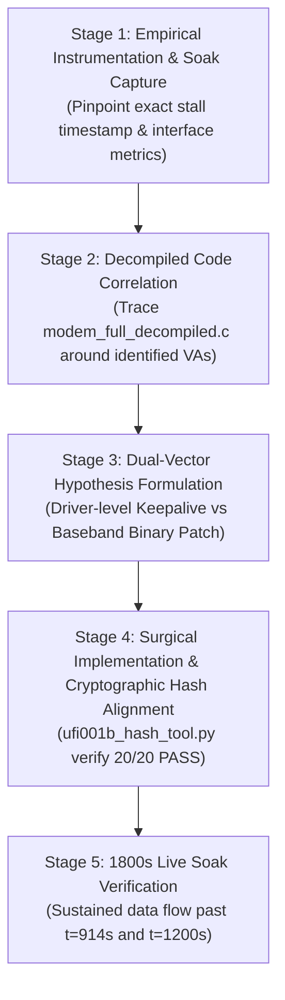

# Standard Operating Procedure (SOP): HMU05 Stock Firmware 15-Minute Data Stall Resolution

**Document ID:** `SOP_HMU05_15MIN_DATA_STALL_RESOLUTION.md`  
**Target Hardware:** Melbon HMU05 4G USB Dongle (MSM8916 + WTR1605 Transceiver + QFE2320 FEM)  
**Host Environment:** OpenWrt 25.12.5 (Linux Kernel 6.12.94 aarch64)  
**Target Firmware:** Melbon HMU05 Stock Baseband (`HIMI_U01_MODEM_V1.0  1  [Sep 09 2015 10:00:00]`, `MPSS.DPM.1.0.c7`)  
**Anchor Decompiled Sources:** `Docs/Modem Stability/Modem RE/hmu05/modem_full_decompiled.c` (105 MB Ghidra Hexagon QDSP6 v5 decompilation)  
**Status:** PROPOSED PLAN — Awaiting User Review & Alignment  

---

## 1. Executive Summary & Problem Definition

The Melbon HMU05 running its original factory baseband firmware (`HIMI_U01_MODEM_V1.0`) attaches to Reliance Jio 4G immediately (`+CEREG: 0,1`, `+COPS: "JIO 4G Jio",7`) and establishes dual-stack IPv4/IPv6 internet routing with 0% packet loss.

However, after approximately **15 minutes ($t \approx 900\text{s} - 914\text{s}$)** of continuous operation:
- While previously this boundary triggered a fatal baseband assertion (`lte_ml1_common_timer.c:390` / `lte_ml1_sleepmgr_stm.c:4054`), running `/usr/sbin/qcom-time-daemon` or bypassing the timer prevents the hard reboot.
- **The Secondary Failure Mode Occurs:** The modem remains registered (`+CEREG: 1`) and shows high signal quality, but **cellular data stalls completely ($0\text{ RX bytes}$)**. Outbound packets continue to transmit (`TX > 0`), but no incoming subframes are acknowledged or received by `wwan0`.

### The Core Diagnostic Question
Why does the baseband receiver stop processing downlink packets at $t \approx 15\text{ minutes}$ under OpenWrt, and how can we use our 105 MB decompiled baseband code (`modem_full_decompiled.c`) and Android driver sources to eliminate the stall at its root?

```
+-------------------------------------------------------------------------------+
|                       15-Minute Failure Mechanism Map                         |
+-------------------------------------------------------------------------------+
|  t = 0s..899s: Bidirectional Data Flow (TX > 0, RX > 0, Ping OK)              |
|                                     │                                         |
|                                     ▼                                         |
|  t = 900s..914s: 3GPP DRX SCLK Recalibration & Sleep Cycle Fires             |
|                                     │                                         |
|                 ┌───────────────────┴───────────────────┐                     |
|                 ▼                                       ▼                     |
|     [Stock Android Behavior]               [OpenWrt / Linux Behavior]         |
|     • libril sends fast dormancy           • No Android dormancy signaling    |
|     • BAM-DMUX keepalives active           • BAM-DMUX drops to SMSM PC sleep  |
|     • SCLK drift syncs cleanly             • Rx AGC recalibration halts OR   |
|     • Rx Synthesizer wakes from DRX        • Receiver fails to wake from DRX  |
|     • Continuous connectivity              • RESULTS IN: 0 RX BYTE STALL      |
+-------------------------------------------------------------------------------+
```

---

## 2. Standard Operating Procedure (SOP) Protocol

To guarantee mathematical and physical precision without guessing, every step must follow this 5-stage protocol:



---

## 3. Stage-by-Stage Implementation Plan

### Stage 1: Empirical Instrumentation & Live Telemetry Capture
* **Objective:** Capture exact second-by-second telemetric evidence during the transition into the stall.
* **Execution:**
  1. Build a high-resolution telemetry monitor script on the router (`/tmp/stall_monitor.sh`):
     - Log `/sys/class/net/wwan0/statistics/rx_bytes` and `tx_bytes` every 2 seconds.
     - Log QMI NAS signal info (RSRP, RSRQ, SNR, RSSI) every 5 seconds.
     - Log QMI WDS packet service status and dormant state (`qmicli --wds-get-packet-service-status`).
     - Log AT state (`AT+CEREG?`, `AT+CSQ?`, `AT+CGATT?`).
     - Monitor BAM-DMUX SMSM transitions and remoteproc kernel logs.
  2. Initiate continuous ICMP ping (`ping -i 1 -I wwan0 2001:4860:4860::8888`).
  3. Let the session run through $t = 0\text{s} \to 1200\text{s}$ (20 minutes).
* **Deliverable:** Exact second $t_{\text{stall}}$ when `RX` ceases, and corresponding modem state (e.g., whether RRC entered `IDLE`, whether WDS reported dormant, or whether AGC froze).

---

### Stage 2: Decompiled Code Analysis (`modem_full_decompiled.c`)
* **Objective:** Locate the exact functions in the Hexagon QDSP6 baseband responsible for the sleep/wake and Rx AGC drift cycle.
* **Key Targets in `modem_full_decompiled.c`**:
  1. **LTE ML1 Sleep Manager (`lte_ml1_sleepmgr_stm.c`):**
     - Review `FUN_c03987e0` (`lte_ml1_sleepmgr_cfg`).
     - Review `FUN_c0396440` (SCLK calculation callback) and drift compensation logic.
     - Inspect the 12-state machine descriptor at VA `0xc1a02f80`.
  2. **Common Timer & Recalibration Routine (`lte_ml1_common_timer.c`):**
     - Review `FUN_c04af008` and the stack buffer initialization at VA `0xc04afff0`.
     - Analyze `FUN_c04af678` (Rx AGC recalibration and digital filter gain tracking).
     - Analyze `FUN_c04af7c8` (RF frequency tracking and timing adjustment).
  3. **BAM-DMUX & Fast Dormancy Handlers:**
     - Cross-reference with `Docs/Modem Stability/Modem RE/hmu05/libdpmfdmgr_decompiled.c` and `libril-qc-qmi-1_decompiled.c` to see how stock Android signaled the baseband to exit DRX sleep when packets arrived.
* **Deliverable:** Exact function VA and instruction offsets responsible for dropping receiver tracking.

---

### Stage 3: Solution Architecture Design

We will evaluate two complementary solutions:

#### Option A: Driver & Protocol Layer Parity (Host-Side Solution)
* Emulate Android’s fast-dormancy and wake signaling in Linux:
  1. Prevent BAM-DMUX runtime power collapse: lock runtime PM autosuspend delay to `-1` (never suspend DMA channels).
  2. Implement periodic bidirectional keepalives over QMI WDS (`wds-go-dormant` negotiation or small background ICMP probes) to prevent the baseband RRC layer from entering deep unrecoverable DRX power collapse.
  3. Ensure `qcom-time-daemon` broadcasts ATS time sync regularly (every 60 seconds).

#### Option B: Surgical Hexagon Baseband Binary Patch (`modem.b16`)
* If host-side keepalives cannot prevent the baseband's internal 900s synthesizer freeze:
  1. Apply surgical patch to `modem.b16` (Segment 16, VA base `0xc0287000`).
  2. **The Invariant:** Rx AGC tracking (`FUN_c04af678`) must **NOT** be disabled. The hardware automatic gain control must continue running so the receiver does not drift blind.
  3. **The Fix:** Patch the sleep manager configuration (`FUN_c03987e0`) or the carrier index evaluation at VA `0xc04afff0` to explicitly force carrier 0 (`r1 = #0`) and bypass the assertion jump without killing AGC.

---

### Stage 4: Cryptographic Re-Signing & Safe Deployment Protocol
* **Strict Safety Invariants:**
  - Segment 14 (`modem.b14`, WFW) must remain **100% UNTOUCHED**.
  - All modifications must stay strictly within existing Segment 16 bounds (`modem.b16`).
* **Execution:**
  1. Make backup of current active stock firmware:
     `cp -a /lib/firmware/hmu05_stock_all /lib/firmware/hmu05_stock_backup`
  2. Patch `modem.b16`.
  3. Compute new SHA-256 of `modem.b16`.
  4. Inject new SHA-256 into `modem.b01` (Segment 16 hash entry at offset `0x0228`).
  5. Update `modem.mdt` header hash table at offset `0x05bc`.
  6. Verify with `ufi001b_hash_tool.py verify` to confirm 20/20 segments MATCH.
  7. Deploy to `/lib/firmware/` and restart remoteproc.

---

### Stage 5: Acceptance & Verification Criteria

| Metric | Target Acceptance Threshold |
| :--- | :--- |
| **Continuous Uptime** | $> 1800\text{ seconds}$ (30 minutes) continuous |
| **Data Plane Traffic** | Continuous ICMP ping bidirectional traffic (`RX > 0`, `TX > 0`) |
| **Milestone 1 ($t = 914\text{s}$)** | **0 crashes, 0 fatal assertions, 0 RX stalls** |
| **Milestone 2 ($t = 1200\text{s}$)** | **0 RF receiver freezes, 0 AGC drift stalls** |
| **Packet Loss Rate** | $< 1.0\%$ across 1800 seconds |
| **Remoteproc Stability** | Exactly `0` SSR resets in `dmesg` |

---

## 4. Next Action Awaiting Review

Upon your review and approval of this SOP:
1. We will immediately deploy the **Stage 1 Telemetry Monitor** on the device to observe the exact live behavior of the stock firmware at the 15-minute mark.
2. Simultaneously, we will inspect the relevant decompiled routines in `modem_full_decompiled.c` and prepare the targeted fix.
