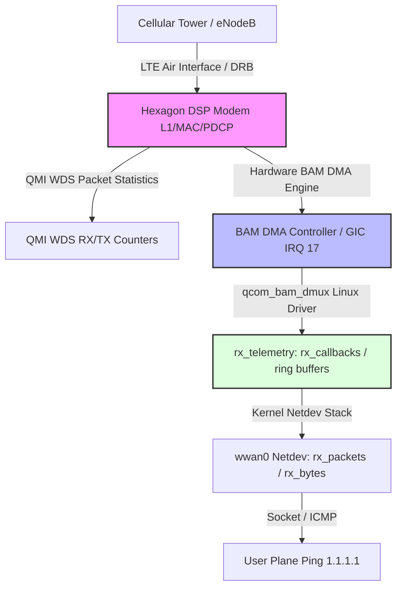

# Phase 2 Engineering Plan: Modem L1/DRB Air Interface vs. BAM-DMUX Transport Differentiation

## 1. Context & Objective
The fast-dormancy hypothesis has been **100% ruled out**: the baseband reports `traffic-channel-active(2)` and `uplink_fc=FLOWING` throughout the freeze. Furthermore, the freeze occurred at $t = 869\text{s}$ ($14\text{m}29\text{s}$), before the nominal 900s boundary, indicating a dynamic receive-path or descriptor-queue stall rather than a pure SCLK rollover.

The objective of this phase is to isolate the exact fault boundary at the moment of failure:
> **Did the modem’s LTE L1/DRB/RF stack stop receiving packets from the carrier, or did the modem receive packets but fail to deliver them across the BAM-DMUX DMA transport to the Linux host?**

---

## 2. Telemetry Architecture & Decision Matrix

At the exact freeze point, we will correlate metrics across four distinct architectural layers:



### Decisive Evaluation Matrix

| Observation at Freeze Point | QMI WDS RX (`qmicli`) | BAM IRQ 17 (`/proc/interrupts`) | BAM Telemetry (`rx_callbacks`) | Netdev (`wwan0` RX) | Root Cause Fault Domain |
| :--- | :--- | :--- | :--- | :--- | :--- |
| **Fault Pattern 1** | **Stops** | **Stops** | **Stops** | **Stops** | **Modem L1/DRB / Baseband Air Interface:** The baseband has stopped receiving radio frames from the carrier or its internal PDCP/RLC stack is wedged. |
| **Fault Pattern 2** | **Advances** | **Stops** | **Stops** | **Stops** | **Modem-to-BAM IPC Pipe:** The baseband received downlink packets over LTE, but failed to initiate DMA transfers across the BAM bus. |
| **Fault Pattern 3** | **Advances** | **Advances** | **Stops** | **Stops** | **Host BAM DMA Interrupt / ISR Staging:** Hardware BAM asserted IRQ 17, but the driver ISR or completion queue is deadlocked. |
| **Fault Pattern 4** | **Advances** | **Advances** | **Advances** | **Stops** | **BAM-DMUX Channel Demux / Netdev Path:** Descriptors are returned and handled, but packets are discarded during header parsing or netifd delivery. |

---

## 3. Data Sources & Extraction Channels

### 3.1 QMI WDS Packet Statistics (Hexagon Internal Layer)
Queried via QMI proxy:
```bash
qmicli -d /dev/wwan0qmi0 -p --wds-get-packet-statistics
```
Extracts:
- `TX packets OK` / `RX packets OK`
- `TX bytes OK` / `RX bytes OK`
- `TX packets dropped` / `RX packets dropped`

### 3.2 Host BAM-DMUX Driver Telemetry (Kernel Transport Layer)
Node: `/sys/devices/platform/soc@0/4080000.remoteproc/4080000.remoteproc:bam-dmux/rx_telemetry`
Extracts:
- `rx_callbacks`: Total completed DMA RX callback invocations.
- `rx_last_callback_ms_ago`: Elapsed time since the last packet was transferred by BAM DMA.
- `rx_queued_buffers`: Number of skbs currently waiting in the BAM RX descriptor ring (nominal: 32).
- `rx_slots_submitted`: Descriptors owned by hardware BAM (nominal: 32).
- `rx_slots_free`: Free slots in the software ring.
- `rx_submit_failed`: Cumulative count of failed descriptor allocations.
- `pc_state` / `pc_ack_state`: SMSM power control state.
- `runtime_status`: Driver PM status (`active` vs `suspended`).

### 3.3 Hardware Bus & Interrupts
Node: `/proc/interrupts`
- IRQ 17: `bam_dma` (GIC Level interrupt from BAM engine).
- IRQ 45/46: `4080000.remoteproc:bam-dmux` (SMSM power control edge interrupts).

### 3.4 Kernel Netdev & User Plane
- `/sys/class/net/wwan0/statistics/{rx_packets,tx_packets,rx_bytes,tx_bytes}`
- `ping -c 1 -W 1 1.1.1.1`

---

## 4. Test Orchestration & Execution Protocol (`capture_l1_vs_bam.py`)

### 4.1 Test Lifecycle
1. **Cold Boot ($t = 0$):** Target clean reboot to start with pristine baseband and fresh BAM ring.
2. **Experimental Isolation:** Verify `qcom-time-daemon` is stopped.
3. **Continuous Polling (Every 5s from $t = 0$ to Freeze):**
   - User-plane ping status (`1.1.1.1`)
   - `wwan0` RX/TX packet counts
   - BAM IRQ 17 counter
   - `rx_telemetry` (`rx_callbacks`, `rx_last_callback_ms_ago`, `rx_queued_buffers`)
   - QMI WDS RX/TX packet statistics
4. **Freeze Detection Trigger ($t \approx 850\text{s} - 900\text{s}$):**
   When 3 consecutive pings fail:
   - Freeze the timeline.
   - Run 5 high-speed 1-second correlation bursts querying all 4 layers simultaneously.
   - Compute deltas ($\Delta \text{QMI\_RX}$, $\Delta \text{BAM\_IRQ17}$, $\Delta \text{rx\_callbacks}$, $\Delta \text{wwan0\_RX}$).
   - Evaluate against the Fault Evaluation Matrix.
   - Monitor post-freeze behavior for 60 seconds without issuing resets.

### 4.2 Diagnostic Protection Commitments
- **Zero Injected Resets:** Strictly **no** `GO_DORMANT`, `GO_ACTIVE`, radio power cycling, or netifd reconnects during the capture.
- **Data Preservation:** Telemetry will be streamed to stdout and logged to `Docs/Modem Stability/l1_vs_bam_telemetry.csv`.

---

## 5. Approval Request
Do you approve proceeding with:
1. Creating the automated correlation orchestrator `capture_l1_vs_bam.py`?
2. Rebooting the router cleanly to initialize $t=0$?
3. Running the high-resolution soak test until the freeze to isolate Modem L1 vs. BAM-DMUX?
