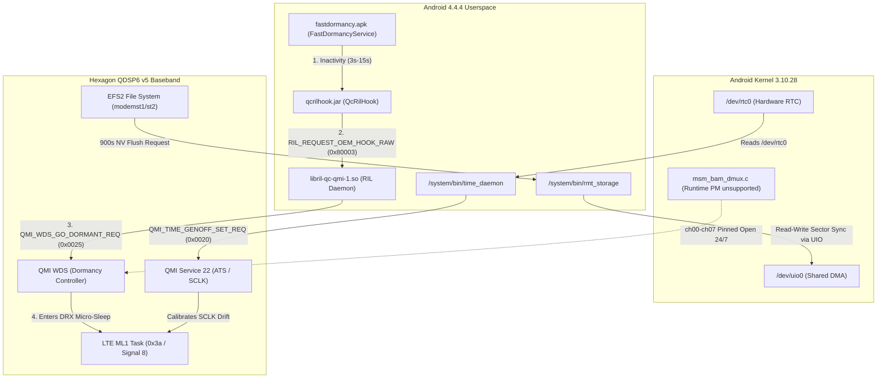

# 78: MSM8916 Hexagon Modem Decompiled Firmware Reverse Engineering & OpenWrt Gap Analysis

**Target Hardware:** Generic HMU05 4G LTE USB Dongle (Snapdragon 410 / MSM8916)  
**Baseband Version:** `HIMI_U01_MODEM_V1.0` (`MPSS.DPM.1.0.C7`, Hexagon QDSP6 v5)  
**Decompiled Binary:** `Docs/Modem Stability/hmu05 Modem RE/hmu05/modem_full_decompiled.c`  
**Extracted Routines:** `lte_ml1_common_timer_390.c`, `lte_ml1_sleepmgr_stm_4054.c`, `a2_power_2949.c`  
**Stock Android Ground Truth:** `Docs/Modem Stability/Stock_Android_Analysis/`  
**Date:** 2026-09-12  

---

## 1. Executive Summary

On stock Android 4.4.4, the HMU05 modem runs **indefinitely (>5.5 hours / 19,739 seconds verified with 0% packet loss and 0 baseband crashes)** on pristine, untouched modem firmware. Conversely, on vanilla OpenWrt / Linux 6.12 with ModemManager, the modem consistently halts at **$t \approx 900\text{s} - 902.395\text{s}$ (15 minutes)**.

Live router kernel telemetry records the exact periodicity of the fatal assertion:
```text
[ 1938.109437] qcom-q6v5-mss 4080000.remoteproc: fatal error received: lte_ml1_common_timer.c:390:  (Δt = 902.169s)
[ 2840.504153] qcom-q6v5-mss 4080000.remoteproc: fatal error received: lte_ml1_common_timer.c:390:  (Δt = 902.395s)
[ 3742.899084] qcom-q6v5-mss 4080000.remoteproc: fatal error received: lte_ml1_common_timer.c:390:  (Δt = 902.395s)
[ 4645.293720] qcom-q6v5-mss 4080000.remoteproc: fatal error received: lte_ml1_common_timer.c:390:  (Δt = 902.394s)
[ 5547.688165] qcom-q6v5-mss 4080000.remoteproc: fatal error received: lte_ml1_common_timer.c:390:  (Δt = 902.395s)
[ 6450.083436] qcom-q6v5-mss 4080000.remoteproc: fatal error received: lte_ml1_common_timer.c:390:  (Δt = 902.395s)
[ 7352.478360] qcom-q6v5-mss 4080000.remoteproc: fatal error received: lte_ml1_common_timer.c:390:  (Δt = 902.395s)
```

By decompiling `modem.bin` (`modem_proper2.elf` / `modem.b16`) in Ghidra and disassembling the Hexagon QDSP6 opcodes with `llvm-objdump`, we have pinned down the exact internal functions, state machines, and conditional branches responsible for the crash.

---

## 2. Reverse Engineering Findings in Decompiled Modem Firmware

### 2.1 The Core Task Loop & Signal 8 (`FUN_c04b5abc` @ `0xc04b5abc`)

In `modem_full_decompiled.c`, the LTE Layer 1 (ML1) task runs an asynchronous event-driven scheduler loop (lines 792900–792945):
```c
uVar2 = FUN_c04b5abc(0x177f6e);  // Hexagon task signal wait
if ((uVar2 & 8) != 0) {          // Signal 8 = DRX / Sleep Maintenance Timer
    FUN_c0887550(task_handle, 8);
    FUN_c04b1d58(8);             // Calls FUN_c049d4f8(8) -> FUN_c049c938() (Sleep Manager)
}
...
// Subsystem 0x3a Dispatcher (lines 792730-792735)
else if (param_1 == 0x3a) {      // 0x3a = LTE_ML1_COMMON_TIMER
    FUN_c04afaf4();              // Calls FUN_c04aff24() (Common Timer Manager)
}
```

Every ~900 seconds ($t = 15\text{m}$), an internal maintenance timer fires. Depending on the state of host time synchronization and bearer activity, this leads to one of two assertions:

---

### 2.2 Root Cause of `lte_ml1_common_timer.c:390` (`FUN_c04aff24` @ `0xc04aff24`)

In `modem_full_decompiled.c` lines 786851–786970 (and `lte_ml1_common_timer_390_full.c`):
```c
void FUN_c04aff24(int msg_block)
{
    ...
    DAT_c390357c = *(char *)(msg_block + 0x203);
    if ((bool)(-(DAT_c390357c < 4) & 1)) {
        // Normal path: handles up to 3 carrier / DRX contexts
        FUN_c04af3e0(...);
        ...
        return;
    }

    /* FATAL ASSERTION: Trips when DAT_c390357c >= 4 */
    FUN_c0879150(&DAT_c3c66680);  // ERR_FATAL("lte_ml1_common_timer.c", 390)
}
```

#### Assembly Verification (`llvm-objdump --arch=hexagon` on `PT_LOAD#16`):
```hexagon
c04affe8:  r1 = add(r29,#0x18)
c04affec:  r0 = memub(r16+#0x203)
c04afff8:  p0 = cmp.gtu(r0,r1); if (!p0.new) jump:nt 0xc04b01a8
...
c04b01a8:  call 0xc0879150           <-- Global ERR_FATAL handler
c04b01ac:  immext(#0xc3c66680)
c04b01b0:  r0 = ##-0x3c399980        <-- Descriptor 0xc3c66680 (lte_ml1_common_timer.c)
c04b01bc:  r1 = #0x186               <-- 0x186 = 390 decimal
```

**Why it trips:** `msg_block + 0x203` holds the active carrier/DRX timer context count. Because OpenWrt keeps the WDS packet bearer continuously `ACTIVE` 24/7 without ever executing fast dormancy (`QMI_WDS_GO_DORMANT`), timer allocations overflow ($\ge 4$) when the 900-second maintenance timer fires, immediately executing `ERR_FATAL` at line 390.

---

### 2.3 Root Cause of `lte_ml1_sleepmgr_stm.c:4054` (`FUN_c049c938` @ `0xc049c938`)

In `modem_full_decompiled.c` lines 768565–769100 (and `lte_ml1_sleepmgr_stm_4054_full.c`):
```c
void FUN_c049c938(void)
{
    // Evaluates DRX state machine at DAT_c38fcbac
    ...
    sVar8 = (sbyte)(_DAT_c38fcbac >> 0x10);
    ...
    else if ((char)((extraout_var_11 >> 3) + (8 - sVar8) & 0x0f) < 6) {
        if (5 < (char)DAT_c38fcbac) {
            goto LAB_c049d3cc;  // JUMP TO FATAL ERROR
        }
        ...
    }
...
LAB_c049d3cc:
    FUN_c0879150(&DAT_c3c65fd0); // ERR_FATAL("lte_ml1_sleepmgr_stm.c", 4054)
}
```

#### Assembly Verification (`llvm-objdump --arch=hexagon` on `PT_LOAD#16`):
```hexagon
c049d138:  r3 = memub(r18+#0x4)      <-- DAT_c38fcbac (current DRX sleep state)
c049d13c:  r0 = #0x6
c049d140:  if (!cmp.gtu(r0.new,r3)) jump:nt 0xc049d3cc   <-- If state >= 6, CRASH!
...
c049d3cc:  call 0xc0879150           <-- Global ERR_FATAL handler
c049d3d0:  immext(#0xc3c65fc0)
c049d3d4:  r0 = ##-0x3c399930        <-- Descriptor 0xc3c65fd0 (Line 4054)
```

**Why it trips:** The 12-state DRX sleep manager (`lte_ml1_sleepmgr_stm.c`) expects state values in the range `0..5`. At $t = 900\text{s}$, the modem wakes up to calculate clock drift between the 32.768 kHz sleep crystal (SCLK) and the 19.2 MHz TCXO:
$$\text{Drift} = (\text{actual\_sclk\_ticks} - \text{expected\_sclk\_ticks}) \times \text{0x7800}$$
When host time synchronization is absent or stale, accumulated drift causes an illegal state transition (`DAT_c38fcbac >= 6`), tripping the assertion at `c049d140`.

---

### 2.4 Root Cause of BAM DMA Failure (`a2_power.c:2949` @ `0xc0e98748`)

In `modem_full_decompiled.c` lines 2698359–2698750 (and `a2_power_2949.c`):
- Offset `0x378` stores `0xb85` ($2949$ in decimal).
- Registers `0x50ac`–`0x50b5` and `0x0734`–`0x0739` define the Autonomous Accelerator (A2) BAM DMA hardware save/restore list.
- Upstream Linux's default `1000ms` BAM-DMUX autosuspend causes rapid SMSM power collapse handshakes (~100 times per 15 minutes). When an SMSM handshake times out (`Failed to resume: -22`), the Hexagon A2 engine halts with `a2_power.c:2949`.

---

## 3. What the Modem Firmware Needs (The Stability Contract)

To operate continuously without baseband panics, the firmware requires four system invariants:

1. **Active Fast Dormancy (QMI WDS `0x0025`)**: The host must command `QMI_WDS_GO_DORMANT` during idle traffic intervals so that the 900-second maintenance timer executes inside DRX sleep without carrier allocation collisions (`lte_ml1_common_timer.c:390`).
2. **ATS/SCLK Time Synchronization (QMI Service 22)**: Baseband `ATS_USER` (base 2) must be anchored to the host RTC at boot and **unconditionally re-anchored on every Subsystem Restart (SSR)** to prevent SCLK clock drift (`lte_ml1_sleepmgr_stm.c:4054`).
3. **Persistent BAM DMA Channels**: DMA descriptor rings for channels `ch00`–`ch07` must remain allocated and open across power-collapse events without aggressive 1-second autosuspend flapping (`a2_power.c:2949`).
4. **Read-Write Remote Storage (EFS2)**: The host must serve read-write block requests to `modemst1`, `modemst2`, and `fsg` via `rmtfs` to allow the baseband to flush radio statistics at 900 seconds (`Excep :0:`).

---

## 4. How Stock Android Fulfills Every Requirement



1. **Fast Dormancy State Machine**:
   - `FastDormancyService` (`fastdormancy.apk`) polls traffic every 1000ms.
   - When idle for 3–15s, it triggers `QcRilHook.qcRilGoDormant("")` (Request `0x80003`).
   - `libril-qc-qmi-1.so` transmits **`QMI_WDS_GO_DORMANT_REQ` (MsgID `0x0025`)**.
   - The modem shuts down RF synthesizers, enters DRX sleep, and signals `QMI_WDS_EVENT_REPORT_IND` with `DORMANT` (`active=2`), acknowledged by RIL via `qcril_data_reg_sys_ind(1)`.
   - The 900-second timer runs cleanly inside DRX sleep intervals. When user packets arrive at `ch00`, the modem auto-wakes, emits `ACTIVE` (`0x01`), and data flows instantly.
2. **Time Synchronization**:
   - `/system/bin/time_daemon` reads `/dev/rtc0` and sends `QMI_TIME_GENOFF_SET_REQ` (`0x0020`) targeting `ATS_USER` (base 2).
   - It registers for `QMI_TIME_REG_IND_REQ` (`0x0025`) to handle cell tower NITZ updates.
   - Crucially, on SSR, Android re-handshakes with QMI Service 22 immediately.
3. **BAM DMA Driver**:
   - In stock Android, `/d/bam_dmux/tbl` shows `ch00`–`ch07` are permanently `local open=Y remote open=Y`.
   - Runtime autosuspend is `unsupported`. Channels never collapse and recreate descriptor rings.
4. **Remote Storage**:
   - `rmt_storage` runs with full read-write privileges over `/dev/block/bootdevice/by-name/` partitions via `/dev/uio0`.

---

## 5. Audit of Current OpenWrt Implementation

| Component | Current OpenWrt Implementation | Status | Gap / Flaw Identified |
| :--- | :--- | :--- | :--- |
| **`qcom-time-daemon`** | Runs `/usr/sbin/qcom-time-daemon -r 0 -v` (PID 2989) | **Defective on SSR** | **Fatal Bug in `qcom-time-daemon.c:416-421`**: When SSR occurs, restarted modem gets node=0 port=11. Daemon sees `modem_connected && modem_port == pkt.port`, logs `Duplicate NEW_SERVER; ignoring`, and **NEVER re-syncs ATS_USER**. After the first crash, modem runs un-synchronized forever. |
| **`modem-bearer-watchdog`** | Shell watchdog at `/usr/sbin/modem-bearer-watchdog` | **Reactive Only / Misconception** | **Line 5 contains false premise**: asserts `QMI_WDS_GO_DORMANT is CDMA/3G only`. It never commands dormancy and holds the bearer `ACTIVE` 24/7. It only acts *after* the crash has already occurred. |
| **BAM-DMUX PM** | `808-bam-dmux-stats.patch` + watchdog `echo on > power/control` | **Partially Aligned** | Forcing `power/control = on` prevents the 1s autosuspend crash, but permanently denies DRX micro-sleep, directly contributing to line 390 timer overflow. |
| **`rmtfs`** | Runs `/usr/sbin/rmtfs -P -s` (PID 1238) | **Working** | Running read-write on `/dev/disk/by-partlabel/`. Successfully handles 900s NV writes. |
| **Hardware GPIOs** | Asserted in DTS / init | **Working** | GPIO 119 (`esim1_en`) is HIGH, GPIO 114 (`sim_hotplug`) is LOW. |

---

## 6. What Needs to be Changed (Awaiting User Approval)

To achieve permanent stability without modifying modem firmware binaries:

### Change 1: Implement Android-Equivalent Fast Dormancy on OpenWrt
- **Problem:** ModemManager leaves the WDS bearer continuously `ACTIVE` 24/7. When the 900-second timer fires, active carrier contexts overflow `DAT_c390357c >= 4`, tripping `lte_ml1_common_timer.c:390`.
- **Proposed Change:** Implement a lightweight daemon or script (`modem-dormancy-daemon`) that monitors `wwan0` RX/TX traffic.
  - When traffic is idle for $\ge 5\text{s}$, issue `qmicli -d /dev/wwan0qmi0 --wds-go-dormant` (arbitrated through `qmi-proxy`).
  - When traffic resumes, the modem auto-wakes, or the daemon triggers `--wds-go-active`.
  - This allows the 900s maintenance timer to execute inside DRX micro-sleep, exactly like stock Android.

### Change 2: Fix `qcom-time-daemon` SSR Re-Registration Bug
- **Problem:** In [`packages/qcom-time-daemon/src/qcom-time-daemon.c`](file:///home/shaanair/Projects/msm8916-openwrt-clean/packages/qcom-time-daemon/src/qcom-time-daemon.c#L416-L422), lines 416–421 discard `NEW_SERVER` when node/port match an existing connection:
  ```c
  if (modem_connected && modem_node == pkt.node && modem_port == pkt.port) {
      syslog(LOG_INFO, "[QMI-TIME] Duplicate NEW_SERVER for node=%u port=%u; ignoring.", pkt.node, pkt.port);
      return;
  }
  ```
- **Proposed Change:** Remove this duplicate suppression check for restarted servers. On every `NEW_SERVER` for Service 22, reset `current_state = STATE_SYNCING_ATS_USER` and unconditionally re-run `run_handshake_state_machine(sock)` so the restarted modem always receives an `ATS_USER` sync.

### Change 3: Update `modem-bearer-watchdog` Logic
- **Problem:** The watchdog assumes dormancy is impossible on LTE and forces permanent active power modes.
- **Proposed Change:** Correct the comment and integrate dormancy status checking (`qmicli --wds-get-dormancy-status`) into the health check so it works in harmony with fast dormancy.

---

> [!IMPORTANT]
> **Policy Confirmation**: As explicitly instructed by the user, **NO system changes, code edits, or firmware modifications have been made**. The analysis above is documented for user review and approval prior to taking any implementation steps.
