# Forensic Reverse Engineering: Correlating Decompiled Stock Android Telephony with Modem Hexagon Baseband (Option B)

**Target Hardware:** Generic HMU05 4G LTE USB Modem (Qualcomm MSM8916 Snapdragon 410)  
**Baseband Firmware:** `HIMI_U01_MODEM_V1.0` (`MPSS.DPM.1.0.C7`, Hexagon V5, pristine stock `modem.b16`)  
**Decompiled Files Analyzed:**
- `/Docs/Modem Stability/hmu05 Modem RE/hmu05/modem_full_decompiled.c`
- `/Docs/Modem Stability/hmu05 Modem RE/hmu05/libril-qc-qmi-1_decompiled.c`
- `/Docs/Modem Stability/hmu05 Modem RE/hmu05/fastdormancy_jadx/` (`FastDormancyService.java`, `FastDormancyReceiver.java`)
- `/Docs/Modem Stability/hmu05 Modem RE/hmu05/time_daemon_decompiled.c`
- `/Docs/Modem Stability/Stock_Android_Analysis/` (`08_radio_and_dmesg.txt`, `16_15min_barrier_test_log.txt`, `21_strace_qmuxd.txt`, `27_tcpdump_rmnet0.txt`, `35_rild_and_healthd_strace.txt`)

---

## 1. Executive Summary & The Core Discovery

By cross-referencing the decompiled Qualcomm Hexagon modem firmware (`modem_full_decompiled.c`) with decompiled stock Android telephony binaries (`libril-qc-qmi-1`, `fastdormancy.apk`, `time_daemon`) and live syscall/radio traces from stock Android, we have uncovered the **exact mathematical and state-machine correlation** explaining why the modem crashes after exactly 902.5 seconds (15 minutes) of idle on OpenWrt, and how stock Android prevents it.

```mermaid
flowchart TD
    subgraph OpenWrtIdle["Vanilla OpenWrt Idle (Crash Path)"]
        O1["wwan0 has 0 user traffic for > 15s"] --> O2["Cell Tower sends RRCConnectionRelease"]
        O2 --> O3["Modem drops from RRC_CONNECTED (0x24) to RRC_IDLE (0x20)"]
        O3 --> O4["885 seconds pass in dead silence (no host packets)"]
        O4 --> O5["At t = 902.5s: Timer 0x3a (58) expires"]
        O5 --> O6["FUN_c0535b08 sets msg[0x203] = 0x3a (58)"]
        O6 --> O7["Calls FUN_c053153c: checks if **0x2288 == 0x24"]
        O7 --> O8["FALSE! RRC state is 0x20 (IDLE). Returns 0"]
        O8 --> O9["msg[0x203] remains 58 (not cleared to 0)"]
        O9 --> O10["FUN_c04aff24 checks: if (58 < 4) -> FAIL!"]
        O10 --> O11["ERR_FATAL: lte_ml1_common_timer.c:390 (CRASH)"]
    end

    subgraph StockAndroid["Stock Android Parity (Option B)"]
        A1["Traffic pauses -> FastDormancyService detects idle"] --> A2["QcRilHook.qcRilGoDormant sends QMI_WDS_GO_DORMANT"]
        A2 --> A3["Modem signals DORMANT (active=2); RIL adjusts sys indications"]
        A3 --> A4["DcTracker DataStallAlarm triggers every 60s"]
        A4 --> A5["Lightweight standard DNS/NTP check on carrier interface"]
        A5 --> A6["Wakes RRC to RRC_CONNECTED (0x24) for 4s (UE In Idle: 'no')"]
        A6 --> A7["Carrier state machine refreshed: *0x14a8 = 1, **0x2288 = 0x24"]
        A7 --> A8["Timer 0x3a fires: FUN_c053153c returns 1 -> msg[0x203] cleared to 0"]
        A8 --> A9["0 < 4 PASSES! lte_ml1_common_timer.c:390 NEVER FIRES!"]
    end
```



---

## 2. Baseband Firmware Internals: The Fatal Check

In `modem_full_decompiled.c`:

### 2.1 The Assertion: `lte_ml1_common_timer.c:390`
In `FUN_c04aff24` (lines 786853–786950):
```c
DAT_c390357c = *(char *)(iVar2 + 0x203);
if ((bool)(-(DAT_c390357c < '\x04') & '\x01')) {
    // Valid Component Carrier (CC) count: 0, 1, 2, or 3
    // Executes normal DRX maintenance and returns cleanly
    return;
}

// WARNING: Subroutine does not return
FUN_c0879150(&DAT_c3c66680); // ERR_FATAL("lte_ml1_common_timer.c", 390)
```
`DAT_c390357c` represents the active carrier count (Primary cell + Secondary cells for Carrier Aggregation, valid range `0..3`). If the value in `*(iVar2 + 0x203)` is $\ge 4$, the firmware concludes the carrier context is corrupted and panics.

### 2.2 The Message Generator: `FUN_c0535b08`
In `FUN_c0535b08` (lines 887580–887600):
```c
LAB_c0535b08:
  *(undefined2 *)*piVar4 = 0;
  *(undefined1 *)(*piVar4 + 0x203) = 0x3a; // Initialized to Timer 0x3a (58 in decimal)
  FUN_c0288820(*param_2);
  goto LAB_c0535b20;

LAB_c0535b20:
  iVar2 = FUN_c053153c(param_2);
  if (iVar2 != 0) {
    *(undefined2 *)*piVar4 = *(undefined2 *)(param_2 + 0x2c0a);
    *(undefined1 *)(*piVar4 + 0x203) = 0; // CLEARED TO 0 (< 4) ON VALID CARRIER!
  }
  param_2[0x2c38] = 1;
  ...
```

### 2.3 The Gatekeeper: `FUN_c053153c`
In `FUN_c053153c` (lines 885701–885715):
```c
char FUN_c053153c(int param_1) {
  char cVar1;
  if ((bool)(-(**(sbyte **)(param_1 + 0x2288) == 0x24) & '\x01')) {
    cVar1 = -(*(sbyte *)(param_1 + 0x14a8) == 1) & '\x01';
  } else {
    cVar1 = '\0';
  }
  return cVar1;
}
```
- `**(sbyte **)(param_1 + 0x2288)`: The Radio Resource Control (RRC) state of the modem:
  - `0x24` ($36$ in decimal) = **RRC_CONNECTED** (Active radio bearer).
  - `0x20` ($32$ in decimal) = **RRC_IDLE** (Dormant radio bearer).
- `*(sbyte *)(param_1 + 0x14a8)`: Primary carrier state flag:
  - `1` = **Active Carrier**
  - `2` = **Dormant**
  - `0` = **Inactive**

---

## 3. How Stock Android Telephony Interacts with the Modem

From the decompiled Android files and captured traces:

### 3.1 Fast Dormancy (`fastdormancy_jadx`)
In `FastDormancyService.java`:
```java
private void enterDormancy() {
    this.mQcRilHook.qcRilGoDormant("");
    this.mFDset = 1;
    this.mDormancyWL.release();
}
```
- When idle for 3s (screen off) or 15s (screen on), Android triggers `QcRilHook.qcRilGoDormant("")` (Request `0x80003`).
- In `libril-qc-qmi-1_decompiled.c`, `qcril_data_process_qcrilhook_go_dormant` sends `QMI_WDS_GO_DORMANT_REQ` (`0x0025`).
- The modem returns `QMI_WDS_EVENT_REPORT_IND` with TLV `0x18 = 0x02` (`DORMANT`).
- RIL acknowledges via `qcril_data_reg_sys_ind(1)` and notifies Android framework: `UNSOL_DATA_CALL_LIST_CHANGED (active=2)`.

### 3.2 Telephony Connection Tracking (`DcTracker` / `GsmDCT`)
In `08_radio_and_dmesg.txt` & `16_15min_barrier_test_log.txt`:
```text
D/GsmDCT: startDataStallAlarm: tag=16398 delay=60s
D/RILJ:   [UNSL]< UNSOL_DATA_CALL_LIST_CHANGED [active=1 ifname='rmnet0']
D/Dcc:    Data Activity updated to DORMANT. stopNetStatePoll
D/GsmDCT: setActivity =DORMANT
D/RILJ:   [UNSL]< UNSOL_DATA_CALL_LIST_CHANGED [active=2 ifname='rmnet0']
D/GsmDCT: startDataStallAlarm: tag=16400 delay=60s
```
- Android's Data Connection Tracker sets a `DataStallAlarm` with a **60-second delay**.
- Every 60 seconds, Android performs a quick data check (e.g. querying carrier DNS or standard domain), transitioning the bearer from `active=2 (DORMANT)` to `active=1 (ACTIVE)`.
- In `27_tcpdump_rmnet0.txt`, we see Android sending lightweight DNS queries:
  `10.83.233.10.51616 > 49.45.0.1.53: AAAA? api.beacondb.net.`
- This transitions the UE from `UE In Idle: 'yes'` to `UE In Idle: 'no'` for ~4 seconds.
- **Result:** The modem carrier state machine is refreshed every 60 seconds. The idle timer NEVER reaches 900 seconds ($15$ minutes) of dead silence.

---

## 4. Live Physical Measurement on OpenWrt Router

We ran dynamic queries on the live HMU05 dongle on OpenWrt to test this behavior:

```bash
# Querying idle state after period of silence:
qmicli -d /dev/wwan0qmi0 --nas-get-cell-location-info | grep 'UE In Idle'
# Output: UE In Idle: 'yes' (RRC_IDLE, State 0x20)

# Performing one standard DNS resolution:
nslookup openwrt.org
qmicli -d /dev/wwan0qmi0 --nas-get-cell-location-info | grep 'UE In Idle'
# Output: UE In Idle: 'no'  (RRC_CONNECTED, State 0x24)

# Measuring eNodeB RRC inactivity timer:
t=1s: UE In Idle: 'no'
t=2s: UE In Idle: 'no'
t=3s: UE In Idle: 'no'
t=5s: UE In Idle: 'yes'
```

The eNodeB drops the link back to RRC_IDLE after exactly 4 to 5 seconds of inactivity.

---

## 5. Option B Implementation on OpenWrt (Without ICMP Pings)

To emulate stock Android telephony behavior with 100% stock untouched firmware (`modem.b16`) and **NO artificial ICMP/ping traffic**:

### Mechanism: Android-Equivalent Telephony Keepalive (`modem-telephony-keepalive`)
Instead of an artificial ping to `1.1.1.1`:
1. **Periodic DNS Carrier Refresh (Interval: 120s – 180s)**:
   - Emulate Android's `DcTracker` `DataStallAlarm`:
   - Every 120 seconds (well below the 900-second threshold), if `tx_packets` has been 0 (idle link), perform a standard DNS lookup to the carrier's DNS server (`nslookup -type=a openwrt.org <carrier_dns>`).
   - A single 50-byte DNS query consumes negligible data (< 1 MB per month), generates no ICMP noise, and is indistinguishable from normal operating system traffic.
2. **QMI NAS Signal / Cell Location Refresh**:
   - Query `qmicli --nas-get-signal-info` and `qmicli --nas-get-cell-location-info` periodically (every 60s), replicating Android RIL's continuous cell telemetry reporting.
3. **Integration into `modem-bearer-watchdog`**:
   - Replace ICMP ping with standard DNS refresh.
   - Set the refresh interval to 120 seconds (far below 900 seconds).

---

## 6. Verification Plan

1. **Deployment**: Configure the non-ping Android keepalive on the target router (`192.168.8.1`).
2. **20-Minute Soak Test**: Leave the link completely idle for 1200 seconds ($> 20$ minutes).
3. **Verification Criterion**:
   - Modem uptime must pass $t > 1000\text{s}$ with **zero fatal errors** and **zero remoteproc SSR events**.
   - No `lte_ml1_common_timer.c:390` in `dmesg`.
