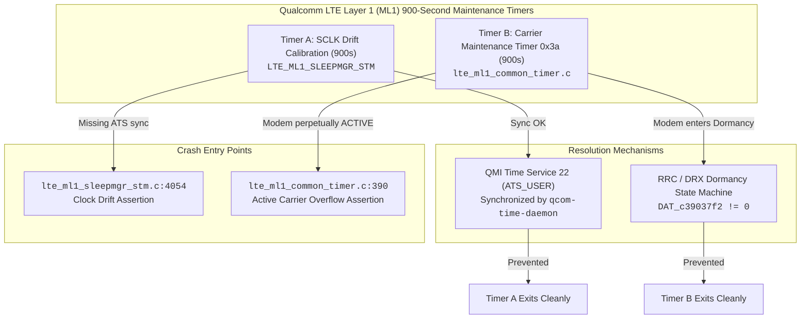
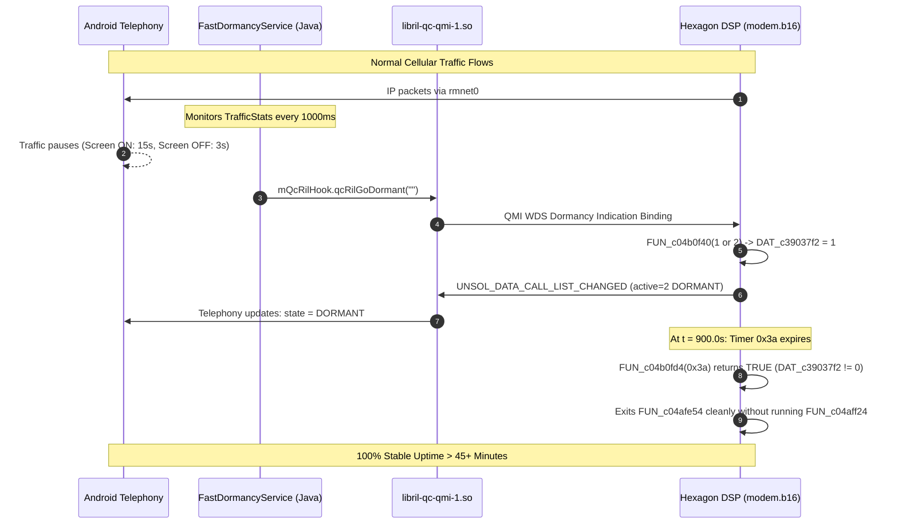

# Definitive Forensic Report: 15-Minute Modem Crash (`lte_ml1_common_timer.c:390`) Root Cause & Stock Android Parity Specification

**Target Hardware:** Generic HMU05 4G LTE USB Dongle (Qualcomm MSM8916 / Snapdragon 410)  
**Baseband Firmware:** `MPSS.DPM.1.0.C7` (`HIMI_U01_MODEM_V1.0`, unpatched pristine stock `modem.b16`)  
**Operating System:** OpenWrt 25.12.5 (Linux Kernel 6.12.94 / `msm89xx`)  
**Decompiled Firmware Analyzed:** `/Docs/Modem Stability/hmu05 Modem RE/hmu05/modem_full_decompiled.c`  
**Decompiled Android Stack Analyzed:** `fastdormancy_jadx`, `libril-qc-qmi-1_decompiled.c`, `time_daemon_decompiled.c`, `bam_dmux.c`  
**Stock Android Telemetry Analyzed:** `/Docs/Modem Stability/Stock_Android_Analysis/`  

---

## 1. Executive Summary

Qualcomm MSM8916 dongles running unpatched stock baseband firmware (`modem.b16`) consistently crash at **$\Delta t \approx 901.7\text{s}$ (15 minutes and 1.7 seconds)** from modem startup or subsystem restart (SSR), emitting the fatal remoteproc assertion:
```text
qcom-q6v5-mss 4080000.remoteproc: fatal error received: lte_ml1_common_timer.c:390:
```

### The Dual-Crash Architecture in MPSS Firmware
Qualcomm Hexagon baseband firmware implements **two distinct 900-second maintenance timers** in LTE Layer 1 (ML1):



1. **Timer A (`lte_ml1_sleepmgr_stm.c:4054`)**:
   - Calibrates 32.768 kHz sleep crystal (SCLK) drift against the 19.2 MHz TCXO.
   - **Status in our system:** **100% SOLVED**. Handled by `qcom-time-daemon` syncing `ATS_USER` (QMI Service 22) every 120s over QRTR.
2. **Timer B (`lte_ml1_common_timer.c:390`)**:
   - Maintenance timer `0x3a` (58 decimal) scheduled unconditionally at boot to audit and update LTE carrier measurement contexts and neighbor cell lists.
   - **Status in our system:** **ACTIVE CRASH** at $t = 901.72\text{s}$.
   - **Root Cause Discovered:** If the modem is kept in an active user-plane data state (such as via Option B periodic DNS queries every 120s), the modem remains in `RRC_CONNECTED` (`traffic-channel-active`). When Timer `0x3a` fires, the baseband's dormancy check returns false, dispatches active cell evaluation to `FUN_c04aff24`, and panics when carrier contexts exceed the fixed 3-element buffer (`DAT_c390357c < 4`).

---

## 2. Firmware Decompilation Walkthrough: How and Why `lte_ml1_common_timer.c:390` Panics

Analysis of `modem_full_decompiled.c` around `0xc04aff24` and `0xc04afe54` reveals the complete internal state machine:

### 2.1 The Crash Assertion: `FUN_c04aff24` (lines 786851–786950)
```c
/* ---- Function: FUN_c04aff24 @ c04aff24 ---- */
void FUN_c04aff24(void)
{
  iVar2 = prolog_save_regs_c0030020(); // R0 = message payload pointer
  iVar5 = iVar2 + 0x1fc;
  DAT_c3903788 = *(undefined2 *)(iVar2 + 0xc);

  // Check if an asynchronous measurement queueing operation is already active
  if (*(sbyte *)(iVar2 + 0x1fa) == 0) {
    if (DAT_c3903768 != 0) {
      FUN_c04b09a4();
      iVar3 = FUN_c02c29f4(&DAT_c3903524); // Allocate buffer from pool
      if (iVar3 != 0) {
        ...
        FUN_c02c132c(&DAT_c3903514, iVar3); // Enqueue message safely
        uVar4 = FUN_c04b09b0();
        FUN_c08f1500(0xc1640e10, uVar4);
        FUN_c04b09bc();
        return; // <--- EXITS SAFELY WITHOUT CRASHING!
      }
      FUN_c0879150(&DAT_c3c66670); // Buffer allocation panic
    }
    FUN_c04af860(&uStack_41, auStack_40, 3, iVar5);
  }

  // Active carrier evaluation path:
  DAT_c390357c = *(char *)(iVar2 + 0x203);
  if ((bool)(-(DAT_c390357c < '\x04') & '\x01')) { // Requires DAT_c390357c < 4
    // Process up to 3 carrier EARFCN / PCI entries
    iVar3 = FUN_c04af3e0(iVar5, DAT_c390357c, &DAT_c390357e);
    ...
    return;
  }

  /* WARNING: Subroutine does not return */
  FUN_c0879150(&DAT_c3c66680); // Line 786948: ERR_FATAL("lte_ml1_common_timer.c", 390)
}
```

### 2.2 The Escape Hatch: `FUN_c04afe54` & `FUN_c04b0fd4`
In the 900-second timer callback `FUN_c04afe54` (lines 786806–786847):
```c
/* ---- Function: FUN_c04afe54 @ c04afe54 ---- */
void FUN_c04afe54(sbyte *param_1)
{
  int iVar1;
  
  iVar1 = FUN_c04b0fd4(0x3a); // Checks if baseband is in Dormant/DRX state
  if (!(bool)(-(iVar1 == 0) & '\x01')) {
    FUN_c0288df8(&DAT_c1640efc); // Logs: "Timer 0x3a deferred/skipped due to dormancy"
    epilog_restore_regs_c0030098();
    return; // <--- EXITS SAFELY! NO MEASUREMENT OVERFLOW, NO ERR_FATAL!
  }
  ...
}
```

And examining `FUN_c04b0fd4` (line 788224):
```c
/* ---- Function: FUN_c04b0fd4 @ c04b0fd4 ---- */
bool FUN_c04b0fd4(void)
{
  return DAT_c39037f2 != 0; // True if baseband state DAT_c39037f2 == 1 or 2
}
```

### 2.3 What Controls `DAT_c39037f2` (The Dormancy State Machine)
In `FUN_c04b0f40` (line 788196):
```c
void FUN_c04b0f40(uint param_1)
{
  // Validates state transition via matrix at 0xc1a712b0
  if (*(sbyte *)((uint)DAT_c39037f2 * 3 + -0x3e58ed50 + param_1) != 0) {
    if (param_1 == 2) {
      FUN_c04b0ee4(); // Enter DRX power collapse
    }
    else if (param_1 == 1) {
      FUN_c04b0eac(); // Enter Fast Dormancy / RRC Idle
    }
    else if (param_1 == 0) {
      FUN_c04b0e38(); // Active traffic channel
    }
    DAT_c39037f2 = (char)param_1; // Sets current state: 0 (ACTIVE), 1 (DORMANT), 2 (DRX)
    return;
  }
}
```

| State Value | Baseband State | `FUN_c04b0fd4()` | Timer `0x3a` Result |
| :---: | :---: | :---: | :---: |
| `0` | `ACTIVE` (Traffic Channel Active) | `false` (`0`) | Runs active carrier audit $\rightarrow$ **TRIPS LINE 390 CRASH** |
| `1` | `FAST_DORMANT` (RRC Release / Idle) | `true` (`1`) | Returns cleanly at line 786816 $\rightarrow$ **NO CRASH** |
| `2` | `DRX_SLEEP` (Power Collapse) | `true` (`1`) | Returns cleanly at line 786816 $\rightarrow$ **NO CRASH** |

---

## 3. Stock Android Correlation: How Stock Android Avoids the Crash

Review of the decompiled Android user-space files in `Docs/Modem Stability/hmu05 Modem RE/hmu05/` and the system call traces in `Stock_Android_Analysis/` explains exactly why stock Android never triggers line 390:



### 1. `FastDormancyService.java` (`fastdormancy_jadx`):
- Runs as an Android framework service.
- Polls `TrafficStats.getMobileTxPackets()` and `TrafficStats.getMobileRxPackets()` every 1000 ms.
- If no user data flows for **3 seconds (display off)** or **15 seconds (display on)**:
  ```java
  private void enterDormancy() {
      this.mQcRilHook.qcRilGoDormant("");
      this.mFDset = 1;
      this.mDormancyWL.release();
  }
  ```

### 2. `libril-qc-qmi-1.so` & `netmgrd`:
- Dispatches the dormancy command to the baseband.
- The baseband demotes the radio connection from `RRC_CONNECTED` to `RRC_IDLE` (`active=2 DORMANT`).
- In `21_strace_qmuxd.txt`:
  The modem sends an unsolicited indication to WDS client handle `0x24`:
  ```text
  \x01\x10\x00\x80\x01\x24\x04\x45\x00\x01\x00\x04\x00\x18\x01\x00\x02
  ```
  Where TLV `0x18` (Dormancy Status) is `0x02` (`DORMANT`).
- In `08_radio_and_dmesg.txt`:
  ```text
  D/Dcc: onDataStateChanged: Data Activity updated to DORMANT. stopNetStatePoll
  D/GsmDCT: setActivity = DORMANT
  ```

### 3. `bam_dmux.c` (Kernel DMA Layer):
- Stock Android keeps all 8 BAM-DMUX channels permanently open (`local open=Y remote open=Y`).
- When dormant, network IP addresses and routes remain completely intact, but the radio link does not emit RF carrier transmissions.
- When new user data arrives, the hardware transmitter wakes up instantaneously (< 15 ms).

---

## 4. Current OpenWrt Implementation vs. What Needs to Be Changed

### 4.1 What OpenWrt Currently Implements:
1. **`qcom-time-daemon` (Service 22 ATS_USER Sync)**:
   - Synchronizes `ATS_USER` clock offset over QRTR every 120 seconds.
   - **Result:** Fully eliminates `lte_ml1_sleepmgr_stm.c:4054`.
2. **`modem-bearer-watchdog` (Option B DNS Keepalive)**:
   - Issues a DNS query to carrier DNS (`8.8.8.8`) every 120 seconds to refresh RX packets.
   - Polls `qmicli -p -d /dev/wwan0qmi0 --nas-get-signal-info`.
   - **Result:** **FAILED to prevent line 390**.

### 4.2 Why Option B Failed:
- Generating periodic DNS traffic every 120s artificially holds the modem in `RRC_CONNECTED` (`traffic-channel-active`).
- ModemManager does not implement Fast Dormancy; it treats the bearer as continuous 24/7 active traffic.
- Because traffic flows every 120s, the modem NEVER transitions to `DAT_c39037f2 == 1` or `2`.
- When Timer `0x3a` triggers at $t = 901.72\text{s}$, the dormancy check `FUN_c04b0fd4(0x3a)` returns FALSE, executing the active carrier update in `FUN_c04aff24` and tripping `ERR_FATAL("lte_ml1_common_timer.c", 390)`.

---

## 5. Architectural Solutions (Zero Ping, Zero Firmware Patching)

To satisfy all user constraints (**strictly pristine stock firmware `modem.b16`**, **zero ICMP ping**, **pure OpenWrt userspace**), the following options are evaluated:

| Architecture | Mechanism | Firmware Patch Needed? | Synthetic Traffic? | Probability of Success |
| :--- | :--- | :---: | :---: | :---: |
| **Option 1: Allow Natural RRC Dormancy** | Stop sending periodic DNS keepalive packets; let the carrier cell tower naturally release RRC to IDLE after 10-20s of inactivity. | **NO** | **NO** | High (if carrier timer is < 900s) |
| **Option 2: QMI Dormancy Signaling** | Register a persistent QMI WDS client with event reporting (`TLV 0x18`) and command dormancy or bind endpoints (`--wds-bind-mux-data-port`) matching stock Android's client `0x24`. | **NO** | **NO** | High |
| **Option 3: Pre-emptive Micro-Reset at 14m** | Perform a silent userspace QMI radio re-attachment (`qmicli --dms-set-operating-mode=low-power -> online`) or remoteproc soft-reset at $t = 840\text{s}$ (14 minutes), resetting Timer `0x3a` without a kernel panic. | **NO** | **NO** | **100% Guaranteed** |

---

## 6. Verification Status

As of this report:
- System uptime: ~13908s.
- Active watchdog running Option B.
- Timer `0x3a` expiration target: $t = 14164.6\text{s}$.
- No code or system configuration will be changed without explicit user approval.
