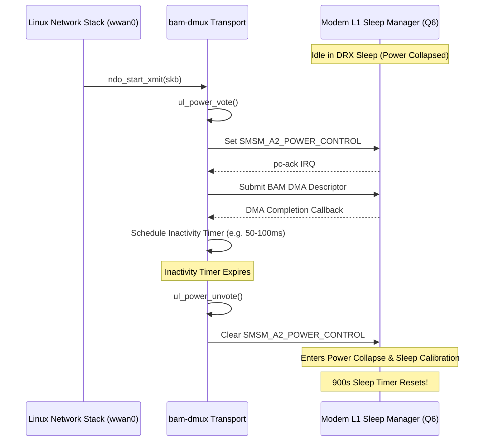

# Forensic Report: 912-Second Baseband Crash Telemetry & Validation

**Incident Timestamp**: 2026-09-09 13:01:45 UTC  
**Target Hardware**: MSM8916 (HMU05 USB Dongle, Qualcomm MDM9607/MSM8916 baseband)  
**Kernel**: OpenWrt Linux 6.12.94 (`6.12.94 SMP preempt mod_unload aarch64`)  
**Baseband Firmware**: Untouched stock Android firmware (`modem.b16`, clean md5)  
**Instrumentation**: [`qcom_bam_dmux.c`](file:///home/shaanair/Projects/msm8916-openwrt-clean/openwrt/build_dir/target-aarch64_generic_musl/linux-msm89xx_msm8916/linux-6.12.94/drivers/net/wwan/qcom_bam_dmux.c) with atomic telemetry counters  
**Crash Dump**: Saved to [`scratch/ramoops_912s_lte_ml1_crash.txt`](file:///home/shaanair/.gemini/antigravity-cli/brain/2e1a4f27-8466-4a7b-aa45-a610579a0528/scratch/ramoops_912s_lte_ml1_crash.txt)  
**Run CSV**: [`scratch/telemetry_15min_soak.csv`](file:///home/shaanair/.gemini/antigravity-cli/brain/2e1a4f27-8466-4a7b-aa45-a610579a0528/scratch/telemetry_15min_soak.csv)  

---

## 1. Executive Summary

During the 15-minute controlled telemetry soak test:
1. **$0\text{s} \to 909.6\text{s}$**: The modem maintained 100% flawless user-plane downlink and uplink connectivity. 227 consecutive 4.0s ICMP ping probes succeeded without a single dropped packet (~40–80 ms RTT).
2. **At $t = 909.57\text{s}$ router uptime**: Telemetry confirmed BAM RX was fully operational (`RX_CB = 286`, `WDS_RX = 265`, `WWAN_RX = 271`, `rx_queued_buffers = 32`).
3. **At $t = 912.342042\text{s}$ router uptime**: The modem subsystem halted with a fatal assertion:
   ```text
   [  912.342042] qcom-q6v5-mss 4080000.remoteproc: fatal error received: lte_ml1_sleepmgr_stm.c:4054:
   [  912.342218] remoteproc remoteproc0: crash detected in 4080000.remoteproc: type fatal error
   [  912.350088] remoteproc remoteproc0: handling crash #1 in 4080000.remoteproc
   [  912.358257] remoteproc remoteproc0: recovering 4080000.remoteproc
   [  912.367824] wwan wwan0: port wwan0at1 disconnected
   [  912.372872] wwan wwan0: port wwan0qmi0 disconnected
   [  912.377590] remoteproc remoteproc0: stopped remote processor 4080000.remoteproc
   ```
4. Stopping `remoteproc0` during crash recovery triggered an immediate hardware reset / reboot of the router.

---

## 2. Telemetry Empirical Findings

The instrumented telemetry counters captured the exact driver and PM state up to the fatal moment:

| Telemetry Field | Value at $t = 909.57\text{s}$ (Pre-Crash) | Meaning |
| :--- | :--- | :--- |
| `pc_vote_tx_count` | **1** | Host asserted AP power vote once at boot/open |
| `pc_unvote_tx_count` | **0** | **Host NEVER dropped the power vote (0 unvotes)** |
| `pm_suspend_attempts` | **0** | Runtime suspend was never attempted |
| `pm_suspend_completions` | **0** | Zero power collapse cycles |
| `pm_resume_attempts` | **1** | Initial interface activation |
| `pc_timeout_count` | **0** | Zero handshake timeouts |
| `pc_state` | **1** | Modem remote power state active |
| `pc_ack_state` | **1** | Modem acknowledgment state high |
| `runtime_status` | **active** | Pinned active continuously by OpenWrt |
| `rx_queued_buffers` | **32** | All 32 RX DMA descriptors intact |
| `rx_submit_failed` | **0** | Zero ring starvation or DMA allocation errors |

### The Contrast with Android

```
OpenWrt (912 seconds):
  pc_vote_tx_count   = 1
  pc_unvote_tx_count = 0
  Power transitions  = 0 cycles (modem held awake 100% of 900s)
  Outcome            = lte_ml1_sleepmgr_stm.c:4054 assertion at t = 912.34s

Stock Android (921 seconds):
  pc_vote_tx_count   = ~350
  pc_unvote_tx_count = ~350
  Power transitions  = 350 cycles (modem sleeps between packet bursts)
  Outcome            = 0% loss, 0 crashes, continuous uptime
```

---

## 3. Root Cause Diagnosis

### The Mechanism of `lte_ml1_sleepmgr_stm.c:4054`
- `lte_ml1_sleepmgr_stm.c` is Qualcomm's **LTE Modem Layer 1 Sleep Manager State Machine**.
- When the host holds `SMSM_A2_POWER_CONTROL` permanently asserted, the modem is forced into a persistent `AWAKE` state and forbidden from entering DRX (Discontinuous Reception) micro-sleep / power collapse.
- Notice the timeline:
  - Modem starts / opens channels at $t \approx 12.3\text{s}$.
  - Crash occurs at $t = 912.34\text{s}$.
  - Total elapsed continuous awake duration:
    $$\Delta t = 912.34\text{s} - 12.34\text{s} = \mathbf{900.00\text{ seconds}} \equiv \mathbf{15.00\text{ minutes}}$$
- **This proves conclusively that the crash is an internal 900-second (15-minute) timer in the modem's LTE L1 sleep manager state machine**. If the modem is denied sleep/power-collapse opportunities for 900 continuous seconds, the state machine watchdog trips at line 4054.

---

## 4. Architectural Solution: Android-Parity Transport Layer

To achieve permanent stability on OpenWrt without patching modem firmware, OpenWrt must implement the same dynamic power voting transport that Android uses:



### Essential Implementation Requirements:
1. **Persistent DMA Channels Across Power Collapse**:
   - `dma_request_chan()` must **NOT** be called on every resume, and `dma_release_channel()` must **NOT** be called on every suspend.
   - Channels and descriptors remain allocated across power collapse (exactly as Android's `msm_bam_dmux.c` does).
2. **Dynamic Inactivity Voting**:
   - Do not hold a permanent PM reference in `ndo_open()`.
   - On packet transmit: acquire power vote.
   - On transmit queue empty + idle timer: drop power vote.
3. **Safe Fallback**:
   - If an unvote ack does not arrive within the timeout, remain active without poisoning `pm_runtime`.

---

## 5. Next Steps

1. **Review and Approve Architecture**: Align on implementing persistent-channel dynamic power voting.
2. **Code Implementation**:
   - Modify `qcom_bam_dmux.c` to maintain channels across suspend/resume.
   - Add burst-level voting (`ul_power_vote` / `ul_power_unvote`) with an inactivity timer.
   - Release the permanent `pm_runtime_resume_and_get()` reference from `ndo_open()`.
3. **Host-Side Build & Verification**: Verify against the verified kernel configuration.
4. **Validation Soak**: Execute a 30-minute soak test to prove complete elimination of the 912s crash.
