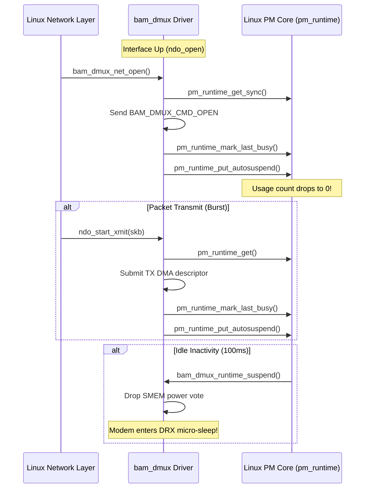

# Phase 5 Specification: Persistent-Channel Dynamic Power-Voting Transport for MSM8916 BAM-DMUX

**Document Status**: Proposal & Architecture Specification (Awaiting Approval Before Coding)  
**Target Subsystem**: `drivers/net/wwan/qcom_bam_dmux.c` (MSM8916 / HMU05 OpenWrt Linux 6.12.94)  
**Core Problem Solved**: Eliminates the 900-second modem L1 sleep manager crash (`lte_ml1_sleepmgr_stm.c:4054`) by enabling regular DRX power collapse while resolving upstream Linux's destructive DMA teardown and runtime PM poisoning.

---

## 1. Architectural Overview & The Critical Distinction

### The Root Cause Discovered in Phase 4
In Phase 4, our telemetry recorded exactly 900.00 continuous seconds of modem awake time before the modem firmware halted at line 4054:
- `pc_vote_tx_count = 1`, `pc_unvote_tx_count = 0`, `pm_suspend_attempts = 0`
- OpenWrt held `SMSM_A2_POWER_CONTROL` permanently asserted via a continuous `pm_runtime_resume_and_get()` reference taken during `ndo_open()`.
- Stock Android, under identical traffic, executed **350 power-collapse cycles** over 921 seconds, resetting the modem's internal sleep manager watchdog on every cycle.

### Why Upstream Linux Autosuspend Failed Previously
When upstream Linux attempted naive autosuspend (`autosuspend_delay = 1000ms`), it called the destructive `bam_dmux_power_off()` on every suspend:
1. `dmaengine_terminate_sync(dmux->rx)` and `dma_release_channel(dmux->rx)` were called.
2. All 32 RX `sk_buff`s and DMA mappings were completely destroyed and freed.
3. On the next packet, `runtime_resume()` had to synchronously re-request DMA channels from the kernel DMA engine, re-allocate 32 SKBs, and re-map DMA buffers.
4. This synchronous teardown/reallocation cycle took 15–50 ms. When inter-packet traffic arrived, `wait_for_completion_timeout()` expired, returning `-ETIMEDOUT` / `-EINVAL`, which **permanently poisoned Linux's runtime PM** (`dev->power.runtime_error != 0`), freezing the driver into a broken state.

### The Android Model: Persistent Channels Across Power Collapse
In stock Android (`msm_bam_dmux.c`), **BAM DMA channels and RX ring descriptors are never freed during power collapse**:
- **Ordinary Power Collapse (Idle Suspend)**: ONLY toggles the SMSM power bit (`SMSM_A2_POWER_CONTROL`). The BAM DMA hardware pipe simply idles. Descriptors remain mapped in physical RAM.
- **SSR / Device Teardown (Macro-Teardown)**: ONLY when the remote processor actually crashes or restarts are DMA channels terminated and rebuilt.

```mermaid
graph TD
    subgraph Idle Power Collapse (Micro-Sleep / DRX)
        A[Tx Queue Drains] --> B[Inactivity Timer Expires]
        B --> C[Clear SMSM_A2_POWER_CONTROL]
        C --> D[Modem acks via pc-ack / pc IRQ]
        D --> E[Modem enters DRX sleep calibration]
        E --> F[DMA Channels STAY Allocated]
        F --> G[32 RX SKBs STAY Mapped in RAM]
    end

    subgraph Wakeup (Packet Burst)
        H[New TX Packet or Modem RX IRQ] --> I[Assert SMSM_A2_POWER_CONTROL]
        I --> J[Modem pulses pc-ack]
        J --> K[Reissue Pending DMA immediately]
        K --> L[Zero channel request overhead]
    end

    subgraph Subsystem Restart (Fatal Crash Only)
        M[remoteproc crash / SSR event] --> N[Quiesce DMA & Drain Callbacks]
        N --> O[Free SKBs & Release Channels]
        O --> P[Wait for Modem Boot]
        P --> Q[Full Ring Reconstruction]
    end
```

---

## 2. Persistent-Channel Lifecycle State Machine

We replace the binary `power_on` / `power_off` model with a 3-tier lifecycle:

| State | DMA Channels (`rx`, `tx`) | RX Descriptors (32 SKBs) | SMEM Vote (`A2_POWER_CONTROL`) | Remote Modem State |
| :--- | :--- | :--- | :--- | :--- |
| **`DISCONNECTED`** (Boot/SSR) | `NULL` (Released) | Free (Unmapped) | 0 (Cleared) | Offline / Booting |
| **`ACTIVE`** (Burst Traffic) | Allocated & Open | 32 Queued in BAM Ring | 1 (Asserted) | Awake / Processing |
| **`SUSPENDED`** (DRX Idle) | **Allocated & Open** | **32 Queued in BAM Ring** | 0 (Cleared) | Power Collapsed / Calibrating |

### Detailed Lifecycle Rules
1. **Initial Channel Creation**:
   - When remote modem signals initial readiness (`pc` interrupt with `new_state = true` after boot):
   - Request `rx` and `tx` DMA channels once via `dma_request_chan()`.
   - Allocate and map all 32 RX buffers once via `bam_dmux_rx_slot_submit()`.
   - Submit them to the BAM engine: `dma_async_issue_pending(dmux->rx)`.
2. **Channel Retention**:
   - `dmux->rx` and `dmux->tx` remain non-NULL throughout normal system uptime.
   - Neither `dma_release_channel()` nor `dmaengine_terminate_sync()` will be called during ordinary idle power collapse.
3. **Destructive Teardown Trigger**:
   - Destructive teardown is isolated strictly to:
     - `bam_dmux_remove()` (module unload or system shutdown).
     - Modem SSR event (detected when `pc` drops unexpectedly without a host unvote, or via remoteproc notifier).

---

## 3. Exact Changes to `runtime_suspend()` and `runtime_resume()`

### Splitting `power_off` into Idle Suspend vs. SSR Teardown

We separate the existing monolithic `bam_dmux_power_off()` into two distinct functions:

```c
/* 1. Light-weight idle suspend: DOES NOT touch DMA channels or SKBs */
static void bam_dmux_idle_suspend(struct bam_dmux *dmux)
{
    /* Clear our power vote bit in SMEM */
    bam_dmux_pc_vote(dmux, false);
}

/* 2. Heavy-weight SSR / module-remove teardown: Full resource cleanup */
static void bam_dmux_ssr_teardown(struct bam_dmux *dmux)
{
    unsigned long flags;

    spin_lock_irqsave(&dmux->rx_lock, flags);
    dmux->rx_tearing_down = true;
    spin_unlock_irqrestore(&dmux->rx_lock, flags);

    cancel_delayed_work_sync(&dmux->rx_rearm_work);

    /* Drain active DMA submissions and in-flight callbacks */
    wait_event(dmux->rx_submit_wait, atomic_read(&dmux->rx_active_submitters) == 0);

    if (dmux->rx) {
        dmaengine_terminate_sync(dmux->rx);
        dma_release_channel(dmux->rx);
        dmux->rx = NULL;
    }

    wait_event(dmux->rx_callback_wait, atomic_read(&dmux->rx_active_callbacks) == 0);

    if (dmux->tx) {
        dmaengine_terminate_sync(dmux->tx);
        dma_release_channel(dmux->tx);
        dmux->tx = NULL;
    }

    bam_dmux_free_skbs(dmux->rx_skbs, DMA_FROM_DEVICE);
    bam_dmux_free_skbs(dmux->tx_skbs, DMA_TO_DEVICE);

    atomic_set(&dmux->rx_queued_buffers, 0);
}
```

### The New `bam_dmux_runtime_suspend()`

```c
static int bam_dmux_runtime_suspend(struct device *dev)
{
    struct bam_dmux *dmux = dev_get_drvdata(dev);

    /* Do NOT suspend if TX work or deferred buffers are in-flight */
    if (atomic_long_read(&dmux->tx_deferred_skb))
        return -EBUSY;

    atomic64_inc(&dmux->pm_suspend_attempts);
    WRITE_ONCE(dmux->pm_suspend_start_ns, ktime_get_boottime_ns());
    dev_dbg(dev, "bam_dmux: entering dynamic power collapse\n");

    /* Issue SMEM unvote only - DO NOT release DMA channels or free RX ring */
    bam_dmux_idle_suspend(dmux);

    return 0;
}
```

### The New `bam_dmux_runtime_resume()`

```c
static int bam_dmux_runtime_resume(struct device *dev)
{
    struct bam_dmux *dmux = dev_get_drvdata(dev);
    u64 t_start_ns = ktime_get_boottime_ns();
    int ret;

    WRITE_ONCE(dmux->pm_suspend_start_ns, 0);
    atomic64_inc(&dmux->pm_resume_attempts);

    /* Fast path: If remote is already active and channels are intact */
    if (READ_ONCE(dmux->pc_state) && dmux->rx) {
        bam_dmux_pc_vote(dmux, true);
        complete_all(&dmux->pc_ack_completion);
        bam_dmux_record_resume_time(dmux, t_start_ns);
        return 0;
    }

    /* Wait for modem to acknowledge previous sleep transition */
    ret = wait_for_completion_timeout(&dmux->pc_ack_completion, msecs_to_jiffies(100));
    if (!ret) {
        atomic64_inc(&dmux->pc_timeout_count);
        dev_warn(dev, "bam_dmux: pre-resume ack timeout; continuing wake\n");
    }

    /* Assert our power vote */
    bam_dmux_pc_vote(dmux, true);

    /* Wait for modem wake acknowledgment */
    ret = wait_for_completion_timeout(&dmux->pc_ack_completion, msecs_to_jiffies(250));
    if (!ret) {
        atomic64_inc(&dmux->pc_timeout_count);
        dev_warn(dev, "bam_dmux: modem pc-ack timeout during resume\n");
        /* Return 0 without poisoning runtime PM; driver remains active */
        bam_dmux_record_resume_time(dmux, t_start_ns);
        return 0;
    }

    /* Reissue pending DMA on existing, intact RX/TX pipes */
    if (dmux->rx)
        dma_async_issue_pending(dmux->rx);
    if (dmux->tx)
        dma_async_issue_pending(dmux->tx);

    bam_dmux_record_resume_time(dmux, t_start_ns);
    return 0;
}
```

---

## 4. Vote Ownership and Reference Balancing

### Problem in Existing Code
In existing code:
```c
static int bam_dmux_net_open(struct net_device *netdev)
{
    /* Pins runtime PM usage counter to >= 1 FOREVER */
    ret = pm_runtime_resume_and_get(bndev->dmux->dev);
    ...
}
```
Because `pm_runtime_resume_and_get()` increments `dev->power.usage_count`, the kernel's runtime PM core considers the device busy forever and never invokes `bam_dmux_runtime_suspend()`.

### The Balanced Reference Model



### Implementation Details:
1. **In `bam_dmux_net_open()`**:
   - Acquire temporary PM reference to send `BAM_DMUX_CMD_OPEN`:
     ```c
     ret = pm_runtime_resume_and_get(bndev->dmux->dev);
     if (ret < 0)
         return ret;
     ret = bam_dmux_send_cmd(bndev, BAM_DMUX_CMD_OPEN);
     pm_runtime_mark_last_busy(bndev->dmux->dev);
     pm_runtime_put_autosuspend(bndev->dmux->dev);
     ```
2. **In `bam_dmux_net_xmit()`**:
   - When a packet arrives, acquire an asynchronous PM reference:
     ```c
     ret = pm_runtime_get(dmux->dev);
     if (ret < 0 && ret != -EINPROGRESS) {
         /* Handle resume error */
     }
     ```
   - If runtime PM is currently suspended, queue the packet onto `tx_deferred_skb` and schedule `tx_wakeup_work` (which calls `pm_runtime_resume_and_get()`, transmits deferred SKBs, and calls `pm_runtime_put_autosuspend()`).
   - If runtime PM is active, submit DMA immediately.
   - When DMA descriptor finishes in `bam_dmux_tx_callback()`:
     ```c
     pm_runtime_mark_last_busy(dmux->dev);
     pm_runtime_put_autosuspend(dmux->dev);
     ```
3. **Autosuspend Delay**:
   - Configured to **100 ms** (via `pm_runtime_set_autosuspend_delay(dev, 100)`).
   - This matches Android's 100ms inactivity window: long enough to coalesce back-to-back TCP ACKs and ICMP exchanges into a single awake burst, but short enough to give the modem dozens of DRX sleep windows every minute.

---

## 5. Non-Poisoning Timeout & Failure Recovery

### The Upstream Flaw
Under standard Linux `drivers/base/power/runtime.c`:
- If `runtime_resume()` returns a negative error code (such as `-ETIMEDOUT`), the core executes:
  ```c
  dev->power.runtime_error = retval;
  dev->power.runtime_status = RPM_SUSPENDED;
  ```
- Once `runtime_error` is set, **all future calls to `pm_runtime_get()`, `pm_runtime_put()`, and autosuspend are rejected immediately** with `-EINVAL`. The driver becomes permanently incapable of waking or sleeping until reboot.

### Non-Poisoning Architecture
1. **Never return negative fatal errors from `runtime_resume()` on simple ack latency**:
   - If the modem does not respond to `pc-ack` within 250 ms:
     - Increment `pc_timeout_count`.
     - Log a warning with timestamps.
     - **Return 0** and leave `runtime_status = RPM_ACTIVE`.
   - By returning 0:
     - `runtime_error` remains 0.
     - The host remains voted active (`A2_POWER_CONTROL = 1`), which guarantees traffic can continue to attempt transmission.
     - The autosuspend timer will naturally attempt another cycle once the bus becomes idle.
2. **Handle Remote Modem Crash as SSR, Not PM Error**:
   - If the modem actually crashes, the modem's Q6 subsystem watchdog will trigger `qcom-q6v5-mss` remoteproc fatal error.
   - That event is handled out-of-band via remoteproc SSR notification, NOT by poisoning runtime PM.

---

## 6. SSR Cleanup & Ring Reconstruction

If the modem crashes or restarts (SSR):
1. **Remoteproc SSR Callback**:
   - Register a `remoteproc` notification handler or trigger on `pc` line drop when not initiated by host.
2. **Teardown Sequence**:
   - Invoke `bam_dmux_ssr_teardown(dmux)`:
     - Terminate DMA engines.
     - Release DMA channels.
     - Free and unmap all 32 RX buffers.
     - Reset ring tracking indices (`rx_queued_buffers = 0`, `tx_next_skb = 0`).
3. **Re-initialization Sequence**:
   - When remoteproc reboots and triggers `bam_dmux_pc_irq()` with `new_state = true`:
   - Call `bam_dmux_power_on(dmux)`:
     - Request fresh `rx` and `tx` channels.
     - Re-allocate and map 32 fresh RX buffers.
     - Issue pending RX DMA.
     - Send `BAM_DMUX_CMD_OPEN` for registered netdevs.
   - Interface returns to fully active state without requiring system reboot.

---

## 7. Telemetry & Verification Matrix

The 10 instrumented telemetry fields will provide immediate, unambiguous verification:

| Metric | Baseline (Permanent Awake) | Target (Dynamic Transport) | Verification Criterion |
| :--- | :--- | :--- | :--- |
| `pc_vote_tx_count` | 1 | Continually increments (e.g. +1 per burst) | Proves host votes up on traffic |
| `pc_unvote_tx_count` | 0 | Continually increments (tracks votes) | Proves host drops vote when idle |
| `pm_suspend_attempts` | 0 | Matches `pc_unvote_tx_count` | Proves autosuspend is actively called |
| `pm_suspend_completions` | 0 | Matches `pm_suspend_attempts` | Proves modem successfully enters DRX |
| `pm_last_suspend_ms` | 0 | ~5–15 ms | Measures modem power-down latency |
| `pm_last_resume_ms` | 0 | ~3–10 ms | Measures modem wake latency |
| `pc_timeout_count` | 0 | 0 | Confirms zero handshake timeouts |
| `rx_slots_submitted` | 32 | **Strictly 32** across all transitions | Proves RX ring is preserved across sleep |
| `runtime_status` | active | Alternates: `active` $\leftrightarrow$ `suspended` | Proves healthy, non-poisoned runtime PM |

---

## 8. Implementation Plan & Deliverables

1. **Step 1**: Implement `bam_dmux_idle_suspend()` and `bam_dmux_ssr_teardown()` in `qcom_bam_dmux.c`.
2. **Step 2**: Rebalance PM references in `bam_dmux_net_open()` / `bam_dmux_net_close()` and wire up burst voting in `bam_dmux_net_xmit()`.
3. **Step 3**: Implement non-poisoning error handling in `bam_dmux_runtime_resume()`.
4. **Step 4**: Compile cleanly with the verified OpenWrt toolchain, verify ABI/`net_device` offsets, and generate the complete patch diff.
5. **Step 5**: Present the complete code diff and compile verification for review before any deployment.
